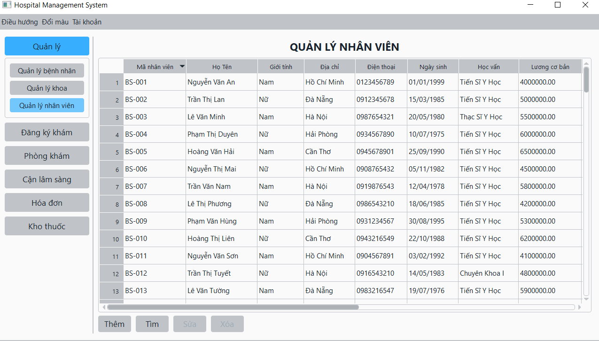

# hospital_management_project
This is an OOP project the second-semester in HCMUS

## Project Structure

```
├─── build
│    ├─── bin              //  executable files
│    └─── obj              //  build files
└─── src
     ├─── controllers      //  controller classes
     ├─── models           //  model classes
     ├─── utils            //  utility classes
     └─── views            //  view classes
```

## Install packages

1. Press **Ctrl+`** to open **Package Manager Console**.
1. Use the command `Update-Package` to restore and update all packages.

## Generate documentation

Run the command: `./packages/Doxygen.1.8.14/tools/doxygen docs/Doxyfile`

# BÁO CÁO ĐỒ ÁN LẬP TRÌNH HƯỚNG ĐỐI TƯỢNG 2025
## A. Giới thiệu 
### 1. Mô tả
**Đồ án lập trình phát triển hệ thống quản lí bệnh viện khám ngoại trú** cho phép người dùng quản lí các các khoa, nhân viên của khoa và thông tin các bệnh nhân hiện có. Ngoài ra hệ thống còn hỗ trợ cho việc quản lí hồ sơ và quy trình khám của bệnh nhân, giúp cho việc mọi việc thực hiện có trình tự và hoàn toàn trở nên dễ kiểm soát và theo dõi. Các tính năng bao gồm lưu trữ hồ sơ bệnh nhân, xử lí hoá đơn và bảo hiểm, kê thuốc, chỉ định cận lâm sàng,... Hệ thống cung cấp giao diện trực quan, đơn giản nhưng cũng không kém phần khoa học giúp người dùng dễ dàng sử dụng. Mục tiêu chính của đồ án này là áp dụng những nguyên lí OOP, sử dụng các desgin pattern để nâng cao chất lượng mã nguồn, đảm bảo hệ thống dễ bảo trì và mở rộng khi cần thiết.
### 2. Ngữ cảnh đồ án
- **Yêu cầu thực tế:** Hệ thống quản lí bệnh viện là một trong những hệ thống thực tế ngoài đời và có tính ứng dụng rất cao. Vì vậy hệ thống đòi hỏi mức độ khó và phức tạp hơn về quy trình và logic nghiệp vụ.
- **Độ phức tạp:** Vì là mô hình hoạt động với lượng tài nguyên khủng, quản lí bệnh viện phù hợp cho việc đòi hỏi thiết kế và triển khai hướng đối tượng nhằm quản lí hiệu quả các đối tượng, đáp ứng tính bảo trì và sẵn sàng mở rộng theo tình hình thực tế của các bệnh viện.
- **Tính đóng gói:** Dữ liệu của bệnh viện như dữ liệu khoa, nhân viên, thông tin bệnh nhân đều phải được bảo mật và che dấu đi cấu trúc bên trong của hệ thống. Ngăn cản bên ngoài trực tiếp truy cập và thay đổi dữ liệu.
- **Tính kế thừa:** Các đối tượng như bác sĩ (`Doctor`), y tá(`Nurse`), tiếp tân (`Receptionist`), bệnh nhân (`Patient`),.. đều là con người và thừa kế các thuộc tính và phương thức chung, song lại có những đặc tính riêng của từng kiểu.
- **Tính đa hình, trừu tượng:** Nhiều đối tượng có những phương thức chung, nhưng lại thực hiện hành vi khác nhau xử lí hoá đơn theo nhiều phương thức(Bình thường, có bảo hiểm,...). Tính trừu tượng giúp người dùng không cần biết cách hoạt động bên trong của hệ thống, chỉ tương tác trên interface, giúp cho việc thực hiện trở nên trừu tượng và đỡ phức tạp.
- **Áp dụng SOLID :** Hệ thống cần phải đảm bảo các nguyên lí quan trọng và cốt lõi để đảm bảo hệ thống dễ quản lí và có hiệu suất cao.
- **Sử dụng desgin pattern:** Đối với hệ thống lớn, xử lí nghiêm ngặt các quy trình thủ tục khám thì các mẫu thiết kế là cần thiết cho việc áp dụng và đảm bảo các nguyên lí OOP.

---

## B. Phạm vi các chức năng
|Chức năng|Mô tả|
|---------|-----|
|Quản lí khoa|Quản lí thông tin của khoa trong bệnh viện|
|Quản lí bệnh nhân| Quản lí thông tin bệnh nhân và bảo hiểm y tế của họ|
|Quản lí nhân viên| Quản lí thông tin các nhân viên như bác sĩ, tiếp tân,..|
|Quản lí kho thuốc|Quản lí thông tin và số lượng thuốc trong kho|
|Quản lí hồ sơ khám ngoại trú|Quản lí thông tin của hồ sơ khám bao gồm thuốc, dịch vụ đã sử dụng|
|Đăng kí khám bệnh|Thực hiện đăng kí khám và đăng kí hàng chờ|
|Khám ngoại trú|Thực hiện chuẩn đoán bệnh cho bệnh nhân, đồng thực kê thuốc hoặc chỉ định cận lâm sàng nếu có|
|Kiểm tra cận lâm sàng|Thực hiện kiểm tra và trả kết quả khám cận lâm sàng, hỗ trợ cho việc chuẩn đoán của bác sĩ|
|Xuất hoá đơn|Thực hiện tính toán các chi phí và xuất ra hoá đơn dựa vào phương thức thanh toán|
---

## C. Hình thức thực hiện
### 1. Thành viên
|MSSV|Họ và tên|Phân công|
|----|---------|---------|
|23120146|Hoàng Ngọc|Nhóm trưởng|
|23120165|Lê Đức Thành|Thành viên|
### 2. Phân công
|Công việc|Phân công|
|---------|---------|
|**Thiết kế** các lớp chứa thông tin đối tượng|Hoàng Ngọc|
|**Triển khai** các lớp thông tin `Object`, `Person`, `Patient`, `Employee`, `Department`,...| Lê Đức Thành|
|**Triển khai** các lớp thông tin `Medicine`, `TestService`, `RoomExamination`, `MedicalRecord`,...| Hoàng Ngọc|
|**Thiết kế** `Repository Pattern` cho việc tương tác dữ liệu| Hoàng Ngọc|
|**Triển khai** repository `Department`, `Employee`, `Patient`| Lê Đức Thành|
|**Triển khai** repository `Medicine`, `TestService`, `MedicalRecord`, `RoomExamination`|Hoàng Ngọc|
|**Thiết kế** `Visitor Pattern` cho việc ghi dữ liệu xuống file| Hoàng ngọc|
|**Triển khai** `Visitor Pattern` cho việc ghi dữ liệu trong các repository| Hoàng Ngọc, Lê Đức Thành|
|**Thiết kế** `Factory Pattern` cho việc đọc dữ liệu từ file| Hoàng Ngọc|
|**Triển khai** `Factory Pattern` cho việc đọc dữ liệu cho các repository|Hoàng Ngọc, Lê Đức Thành|
|**Thiết kế** `Singleton Pattern` cho việc cấu hình và đăng kí cho các repository| Hoàng Ngọc|
|**Triển khai** cấu hình và đăng kí cho các repository|Hoàng Ngọc, Lê Đức Thành|
|**Thiết kế** `State Pattern` cho việc quản lí trạng thái khám hồ sơ| Hoàng Ngọc|
|**Triển khai** quản lí trạng thái hồ sơ khám| Lê Đức Thành|
|**Thiết kế** `Strategy Pattern` cho chức năng thanh toán và xuất hoá đơn|Hoàng Ngọc|
|**Triển khai** chức năng chỉ định phương thức thanh toán|Hoàng Ngọc| 
|**Triển khai** chức năng tìm/thêm/xoá/cập nhật và đọc/ghi dữ liệu cho các lớp quản lí thông tin của `Patient`, `Department` và `Employee`|Lê Đức Thành|
|**Triển khai** chức năng tìm/thêm/xoá/sửa/cập nhật và đọc/ghi dữ liệu cho các lớp quản lí thông tin `MedicalRecord`, `TestService`, `Medicine`, `RoomExamination`|Hoàng ngọc|
|**Cải tiến** tìm kiếm đối tượng `Patient`, `Department`, `Employee`, `Medicine`,... thoả nhiều thuộc tính cùng một lúc hoặc đáp ứng một trong các điều kiện|Lê Đức Thành|
|**Triển khai** các lớp hỗ trợ như `Time`, `Date`,...|Hoàng Ngọc, Lê Đức Thành|
|**Cải tiến** `Prototype Pattern` kết hợp con trỏ thông minh hỗ trợ cho việc cập nhật dữ liệu và đảm bảo tính nhất quán dữ liệu| Hoàng ngọc|
|**Thiết kế** các dịch vụ (Service) cho từng dịch vụ đăng kí, khám bệnh, kiểm tra cận lâm sàn, xuất hoá đơn, quản lí thông tin|Hoàng Ngọc|
|**Triển khai** cài đặt các dịch vụ| Hoàng Ngọc, Lê Đức Thành|
|**Thiết kế** giao diện người dùng bằng `Powerpoint`|Hoàng Ngọc|
|**Triển khai** làm giao diện người dùng bằng `Qt framework`|Lê Đức Thành|
|**Triển khai** làm giao diện quản lí thông tin `Department`,`Patient`,`MedicalRecord`, `Medicine`, `Employee`|Lê Đức Thành|
|**Triển khai** làm giao diện cho quy trình đăng kí|Lê Đức Thành|
|**Triển khai** làm giao diện cho quy trình khám chữa bệnh| Lê Đức Thành|
|**Triển khai** làm giao diện cho quy trình kiểm tra cận lâm sàng|Lê Đức Thành|
|**Triển khai** làm giao diện cho phần đăng nhập|Lê Đức Thành|
|**Triển khai** làm giao diện cho quy trình xuất hoá đơn|Lê Đức Thành|
|**Triển khai** nối các view với model qua controller| Lê Đức Thành|
|**Kiểm thử** các chức năng đọc/ghi file| Hoàng Ngọc|
|**Kiểm thử** các chức năng thêm/xoá/sửa/tìm trong các repository| Hoàng ngọc|
|**Kiểm thử** các lớp cung cấp dịch vụ (Service) cho controller| Hoàng Ngọc|
|**Cải tiến** sử dụng template cho các hàm đọc ghi chung cho các repository|Lê Đức Thành|
|**Cải tiến** tạo `ID` dựa vào `ID` còn thiếu tiếp theo trong mảng để tiết kiệm `ID`| Lê Đức Thành|
|**Cải tiến** tạo ô tick chọn cho giao diện để hiển thị có đang áp dụng bảo hiểm|Lê Đức Thành
|**Cải tiến** hiển thị nhiều khung hình hỗ trợ hiển thị cho các quy trình|Lê Đức Thành|
|**Cải tiến** ẩn hoặc làm mờ các vùng không được nhập hoặc không được phép chỉnh sửa|Lê Đức Thành|
|**Cải tiến** hiển thị danh sách chỉ định mà không cần nhập tay|Lê Đức Thành|
|**Chỉnh sửa** tên các biến, mặt ngữ nghĩa, đảm bảo không tối nghĩa|Lê Đức Thành|
|**Chỉnh sửa** cách tổ chức mã nguồn gọn gàng, cách dòng đều, đẹp|Lê Đức Thành, Hoàng Ngọc|
|**Quản lí** tiến độ và giao nhiệm vụ|Hoàng Ngọc|
|**Quản lí** mã nguồn và họp nhóm|Hoàng Ngọc, Lê Đức Thành|
|**Làm báo cáo** , vẽ Class Diagram, thống kê, ghi nhận|Hoàng Ngọc|
|**Thiết kế** quy trình workflow của hệ thống|Hoàng Ngọc, Lê Đức Thành|
|**Cải tiến** tự động cấu hình, thêm đường dẫn môi trường và các đường đẫn khác bằng `CMake`|Lê Đức Thành|
|**Chuẩn bị** dataset, quy định các đặt tên, id,.... cho các lớp và link đường dẫn cho các file cấu hình|Hoàng Ngọc, Lê Đức Thành|
|**Định nghĩa** code covention để đảm bảo chất lượng mã nguồn|Hoàng Ngọc, Lê Đức Thành|

### 3. Quy trình git
Nhóm sử dụng mô hình Feature Branch workflow để phát triển tính năng một cách độc lập. Mỗi thành viên tạo nhánh riêng cho từng chức năng, sau khi được review sẽ được merge vào nhánh main
- Nhánh chính : `main`, `feature_xyz`
- Quy trình merge: Có người review trước rồi mới hợp vào nhánh.
- Công cụ hỗ trợ: Github quản lí nhánh và theo dõi tiến độ

<p align = "center">

</p>
<p align = "center"><em> Áp dụng phân chia nhánh phát triển chức năng </em></p>

### 4. Coding Covention
- Coding conevtion là tập hợp các quy tắc, hướng dẫn hoặc phong cách viết mã nguồn được thống nhất để đảm bảo tính nhất quán, dễ đọc, dễ bảo trì và giảm lỗi.
- **Trong đồ án này, nhóm đã quy định ra một số quy định và được tổng hợp chi tiết trong** [coding_convention.md](assets/Coding_Convention/coding_convention.md)
- Dự án sử dụng file `.editorconfig` để đảm bảo các quy tắc định dạng được IDE tự động áp dụng cho tất cả thành viên. Điều này giúp mã nguồn luôn thống nhất về indent, encoding và kết thúc dòng, tránh lỗi formatting khi merge.
- Ví dụ áp dụng coding covention trong việc đặt tên class, tên biến trong đồ án.
```cpp
// Đây là lớp được xây dựng trong đồ án áp dụng các cách đặt tên
// Tên lớp PascalCase
class Object { 
protected:
    std::string _id; // camelCase và có '_' đằng trước
    std::string _name; 

public:
    //constructor, destructor

public:
    std::string id() const; // camelCase
    std::string name() const;

public:
    void setId(const std::string& id); // camelCase
    void setName(const std::string& name); 

public:
    
    virtual void acceptWrite(IVisitor* visitor, std::ostream& os) = 0; //camelCase
    virtual Object* clone() const = 0; 

};
```  
- Ví dụ áp dụng coding convention cho việc thiết kế các lớp singleton trong đồ án.

```cpp
/* Áp dụng Singleton cho lớp ServiceLocator thực hiện việc đăng kí tài nguyên cần thiết và cung cấp
dịch vụ cho những nơi cần tiếp. Đảm bảo đúng tính nhất quán về mặt dữ liệu*/
class ServiceLocator {
private:
    // Thuộc tính gồm các IRepository*

private:
    ServiceLocator();

public:
    static ServiceLocator* getInstance();

public:
 // Cung cấp các phương thức để lấy các Service mà Model layer cung cấp
};
```
- Ví dụ sử dụng con trỏ `unique_ptr` để quản lí vùng nhớ hiệu quả trong đồ án
```cpp
class ServiceLocator {
private:
// Sử dụng con trỏ thông minh unique_ptr để kiểm soát và quản lí vòng đời, tránh memory leak
    std::unique_ptr<IPatientRepository> _patients;
    std::unique_ptr<IDepartmentRepository> _departments;
    std::unique_ptr<IRoomExaminationRepository> _rooms;
    std::unique_ptr<IMedicineRepository> _medicines;
    std::unique_ptr<IEmployeeRepository> _employees;
    std::unique_ptr<IMedicalRecordRepository> _records;
    std::unique_ptr<ITestServiceRepository> _tests;
    std::unique_ptr<IParserFactory> _factory;
    std::unique_ptr<EmployeeManager> _employeeManager;
    std::unique_ptr<DepartmentManager> _departmentManager;
    std::unique_ptr<PatientManager> _patientManager;
    std::unique_ptr<MedicineManager> _medicineManager;

private:
    ServiceLocator();

public:
    static ServiceLocator* getInstance();

public:
    //getter, setter
};
```
### 5. Công cụ và môi trường
- **IDE:** Visual Studio 2022 được sử dụng làm môi trường lập trình chính, hỗ trợ đầy đủ tính năng refactor và debug.
- **Compiler:** Sử dụng trình biên dịch MSVC (Microsoft Visual C++) phù hợp với C++ hiện đại.
- **Họp nhóm:**: Google Meet.
- **Giao tiếp**: Facebook.
- **Version Control:** Git được sử dụng để quản lý mã nguồn, kết hợp với GitHub để phối hợp nhóm.

<p align = "center">

</p>
<p align = "center"><em> Giao diện Github </em></p>

- **Trello:** Công cụ quản lí công việc và thời gian.

<p align = "center">
    
</p>
<p align = "center"><em>Giao diện Trello</em></p>

- **Giao diện đồ hoạ**: Qt Framework.

<p align="center">

</p>
<p align="center"><em>Trang chủ qt.io</em></p>

- **Test Framework:** MSTest Framework

<p align="center">

</p>
<p align="center"><em>Trang tài liệu hướng dẫn viết Unit Test</em></p>

## D. Kiến trúc phần mềm và luồng nghiệp vụ hệ thống
### 1. Luồng nghiệp vụ khám của bệnh viện
<p align="center">

</p>
<p align="center"><em>BPMN của quy trình khám chữa bệnh</em></p>

### 2. Kiến trúc phần mềm
Nhóm đã lựa chọn kiến trúc phần mềm MVC (Model-View-Controller) vì:
- **Sự độc lập và phát triển song song:** Vì mỗi thành phần trong MVC có nhiệm vụ riêng và độc lập với nhau, nên mỗi developer có thể đảm nhiệm một thành phần và không ảnh hưởng đến nhau khiến quá trình phát triển diễn ra nhanh chóng, dễ dàng.
- **Dễ dàng sửa đổi:** Việc thêm/cập nhật loại chế độ xem mới được đơn giản hóa trong mẫu MVC (vì một phần duy nhất độc lập với các phần khác).
- **Khả năng học hỏi:** Vì MVC yêu cầu phải phát triển theo nguyên tắc phân tách mối quan tâm (Separation of Concerns – SoC) nên tính áp dụng các nguyên lí OOP và desgin pattern sẽ trở nên phù hợp và cần thiết hơn.

<p align="center">

</p>
<p align="center"><em>Mô tả mô hình MVC</em></p>

## E. Thiết kế và triển khai
### 1. Chức năng quản lí bệnh nhân

#### 1.1 Mô tả chức năng
- Chức năng này dùng để quản lí bệnh nhân, thực hiện các thao tác thêm/xoá/sửa/cập nhật thông tin của một bệnh nhân hoặc bảo hiểm (nếu có). Có chức năng tìm nhân viên theo yêu cầu.

<p align="center">

</p>
<p align="center"><em>Giao diện quản lí bệnh nhân</em></p>

#### 1.2 Áp dụng SOLID
- **SRP:** Lớp `Patient` chỉ đóng vai trò là giữ thông tin bệnh nhân và chỉ thay đổi khi cần thông tin bệnh nhân thay đổi. `TxtWritingVisitor` và `TxtPatientParser` là hai lớp phụ trách riêng cho việc đọc ghi dữ liệu bệnh nhân từ file (Cụ thể là Txt). `TxtPatientRepository` đóng vai trò là trung gian giữa 2 tầng service và database, tương tác trực tiếp với database (file) và cung cấp thông tin cho các `PatientManager` cần biết. `TxtPatientRepository` chỉ có nhiệm vụ lưu trữ dữ liệu xuống file và cung cấp thông tin cho các lớp khác. Khi công nghệ thay đổi, chỉ cần thay đổi sang dạng lớp repository mà không thay đổi đến các tầng khác.
- **OCP:** Lớp Patient có thể mở rộng ra nhiều kiểu bệnh nhân khác nhau (ngoại trú, nội trú,..). Trong khi đó sau này chúng ta có thể phát triển `SQLServerPatientRepository` kế thừa từ `IPatientRepository` và thay thế file Txt. Trong khi đó chúng ta có thể mở rộng cách đọc/ghi vào cơ sở dữ liệu bằng cách mở rộng `IWritingVisistor` và `IParser` để đọc/ghi các kiểu file khác nhau (Json, nhị phân,..), các cách đọc/ghi file khác nhau. 
- **LSP:** Các lớp con đều hoạt động đúng với hành vi của lớp cha.
- **ISP:** Các interface đều được chia nhỏ vừa đủ, không lớn và không có lớp con nào phải override chức năng không cần thiết
- **DIP:** `PatientManager` cần lấy thông tin và dữ liệu thì phụ thuộc và tương tác với `IPatientRepository` , trong khi đó `TxtPatientRepository` phụ thuộc vào chính cái interface và phải override các phương thức bắt buộc của lớp cha. Điều này làm tăng tính trừa tượng, giảm sự phụ thuộc trực tiếp giữa các module mà chỉ phụ thuộc vào `IPatientRepository`. Điều này giúp tăng sự linh hoạt, dễ test, dễ thay đổi khi có yêu cầu mới của bệnh viện. Tương tự như các interface `IParserFactory`, `IParser`,...
#### 1.3 Dependency Injection
Trong chức năng này, kĩ thuật **Dependency Injection** được sử dụng để tiêm vào bằng hàm constructor của `PatientManager`. Điều này làm tăng sự linh hoạt khi kiểm thử hoặc khi thay đổi công nghệ ở lớp repository thì `PatientManager` vẫn không thay đổi.
```cpp
class PatientManager : public IManager<Patient> {
private:
    IPatientRepository* _repo;

public:
    PatientManager(IPatientRepository* repo); 
    // Khởi tạo với TxtPatietnRepository* hoặc SQLServerPatientRepository* đều linh hoạt

public:
    void add(std::unique_ptr<Patient> patient) override;
    void removeById(const std::string& id) override;
    void removeByIds(const std::vector<std::string>& ids);
    void update(const Patient& patient) override;
    std::vector<const Patient*> find(const std::vector<RFilter<Patient>>& filters) const override;
    std::vector<const Patient*> getAll() const override;
};
```
#### 1.4 Desgin Pattern
Trong chức năng này, nhóm đã thực hiện và triển khai hai desgin pattern chính phục vụ cho việc đọc ghi file và repository pattern để làm trung gian cho việc cung cấp thông tin và tương tác trực tiếp với database. Ngoài ra còn có một desgin pattern hỗ trợ cho chủ đề nâng cao.

- **Visitor Pattern** được dùng để ghi thông tin bệnh nhân, phù hợp và xài được cho nhiều kiểu dữ liệu khác có cách ghi khác nhau.
```cpp
class Patient : public Person {
private:
// Thuộc tính
public:
    void acceptWrite(IVisitor* visitor, std::ostream& os) override;
    // Các phương thức khác
};

class TxtWritingVisitor : public IWritingVisitor {
private:
    char _delim;

public:
    TxtWritingVisitor(char delim = '|');

public:
    void write(Patient* patient, std::ostream& os) override;
    // các hàm write khác
};
```
- **Factory Pattern** được dùng để phân biệt và tạo các đối tượng dựa tuỳ vào kiểu được truyền vào nhờ vào map để ánh xạ và lấy đúng kiểu cần parse.

```cpp

class TxtPatientParser : public PatientParser {
protected:
   char _delim;
public:
   TxtPatientParser(char delim = '|');
   Object* parse(const std::string& str) const override; // nhận thông tin và trả về đối tượng
};

class TxtParserFactory : public IParserFactory {
private:
    std::map<std::string, IParser*> _prototypes; // dùng map để ánh xạ

public:
    TxtParserFactory(char delim = '|');
    ~TxtParserFactory();

public:
    IParser* getParser(const std::string& type) const override;
};
```
- **Repository Pattern** thực hiện các chức năng cơ bản CRUD để tương tác với cơ sở dữ liệu hoặc trả về thông tin. `IPatientRepository` kế thừa từ `IRepository`.

```cpp
template<class Entity>
class IRepository {
public:
    virtual ~IRepository() = default;

public:
    virtual void load() = 0;
    virtual void save() const = 0;
    virtual void add(std::unique_ptr<Entity> entity) = 0;
    virtual void removeById(const std::string& id) = 0;
    virtual void removeByIds(const std::vector<std::string>& ids) = 0;
    virtual void update(const Entity& entity) = 0;
    virtual std::vector<const Entity*> data() const = 0;
};
```
- **Prototype Pattern** dành cho mục ở chủ đề nâng cao.

### 1.5 Một số giao diện đồ hoạ chức năng

<p align="center">

</p>
<p align="center"><em>Giao diện thêm một bệnh nhân</em></p>

<p align="center">

</p>
<p align="center"><em>Giao diện xoá bệnh nhân</em></p>

<p align="center">

</p>
<p align="center"><em>Giao diện lọc bệnh nhân</em></p>

<p align="center">

</p>
<p align="center"><em>Giao diện cập nhật thông tin</em></p>

### 2. Quản lí khoa


#### 2.1 Mô tả chức năng
- Chức năng này dùng để quản lí khoa, thực hiện các thao tác thêm/xoá/sửa/cập nhật thông tin của một khoa. Có chức năng tìm khoa theo yêu cầu.

<p align="center">

</p>
<p align="center"><em>Giao diện quản lí khoa</em></p>

#### 2.2 Áp dụng SOLID
- **SRP:** Lớp `Department` chỉ đóng vai trò là giữ thông tin khoa và chỉ thay đổi khi cần thông tin khoa cần thay đổi. `TxtWritingVisitor` và `TxtDepartmentParser` là hai lớp phụ trách riêng cho việc đọc ghi dữ liệu khoa từ file (Cụ thể là Txt). `TxtDepartmentRepository` đóng vai trò là trung gian giữa 2 tầng service và database, tương tác trực tiếp với database (file) và cung cấp thông tin cho các `DepartmentManager` cần biết. `TxtDepartmentRepository` chỉ có nhiệm vụ lưu trữ dữ liệu xuống file và cung cấp thông tin cho các lớp khác. Khi công nghệ thay đổi, chỉ cần thay đổi sang dạng lớp repository mà không thay đổi đến các tầng khác.
- **OCP:** Lớp `Department` có thể mở rộng ra nhiều kiểu khoa khác nhau (khoa ngoại trú, nội trú, ICU,..). Trong khi đó sau này chúng ta có thể phát triển `SQLServerDepartmentRepository` kế thừa từ `IDepartmentRepository` và thay thế file Txt. Trong khi đó chúng ta có thể mở rộng cách đọc/ghi vào cơ sở dữ liệu bằng cách mở rộng `IWritingVisistor` và `IParser` để đọc/ghi các kiểu file khác nhau (Json, nhị phân,..), các cách đọc/ghi file khác nhau. 
- **LSP:** Các lớp con đều hoạt động đúng với hành vi của lớp cha.
- **ISP:** Các interface đều được chia nhỏ vừa đủ, không lớn và không có lớp con nào phải override chức năng không cần thiết
- **DIP:** `DepartmentManager` cần lấy thông tin và dữ liệu thì phụ thuộc và tương tác với `IDepartmentRepository` , trong khi đó `TxtDepartmentRepository` phụ thuộc vào chính cái interface và phải override các phương thức bắt buộc của lớp cha. Điều này làm tăng tính trừa tượng, giảm sự phụ thuộc trực tiếp giữa các module mà chỉ phụ thuộc vào `IDepartmentRepository`. Điều này giúp tăng sự linh hoạt, dễ test, dễ thay đổi khi có yêu cầu mới của bệnh viện. Tương tự như các interface `IParserFactory`, `IParser`,...

#### 2.3 Dependency Injection
Trong chức năng này, kĩ thuật **Dependency Injection** được sử dụng để tiêm vào bằng hàm constructor của `DepartmentManager`. Điều này làm tăng sự linh hoạt khi kiểm thử hoặc khi thay đổi công nghệ ở lớp repository thì `DepartmentManager` vẫn không thay đổi.
```cpp
class DepartmentManager : public IManager<Department> {
private:
    IDepartmentRepository* _repo;

public:
    DepartmentManager(IDepartmentRepository* repo);

public:
    void add(std::unique_ptr<Department> department) override;
    void removeById(const std::string& id) override;
    void removeByIds(const std::vector<std::string>& ids);
    void update(const Department& department) override;
    std::vector<const Department*> find(const std::vector<RFilter<Department>>& filters) const override;
    std::vector<const Department*> getAll() const override;
};
```

#### 2.4 Desgin Pattern
Trong chức năng này, nhóm đã thực hiện và triển khai hai desgin pattern chính phục vụ cho việc đọc ghi file và repository pattern để làm trung gian cho việc cung cấp thông tin và tương tác trực tiếp với database. Ngoài ra còn có một desgin pattern hỗ trợ cho chủ đề nâng cao.

- **Visitor Pattern** được dùng để ghi thông tin khoa, phù hợp và xài được cho nhiều kiểu dữ liệu khác có cách ghi khác nhau.
```cpp
class Department : public Object {
private:
// Thuộc tính
public:
    void acceptWrite(IVisitor* visitor, std::ostream& os) override;
    // Các phương thức khác
};

class TxtWritingVisitor : public IWritingVisitor {
private:
    char _delim;

public:
    TxtWritingVisitor(char delim = '|');

public:
    void write(Department* department, std::ostream& os) override;
    // các hàm write khác
};
```
- **Factory Pattern** được dùng để phân biệt và tạo các đối tượng dựa tuỳ vào kiểu được truyền vào nhờ vào map để ánh xạ và lấy đúng kiểu cần parse.

```cpp

class TxtDeparmentParser : public DepartmentParser {
protected:
   char _delim;
public:
   TxtPatientParser(char delim = '|');
   Object* parse(const std::string& str) const override; // nhận thông tin và trả về đối tượng
};

class TxtParserFactory : public IParserFactory {
private:
    std::map<std::string, IParser*> _prototypes; // dùng map để ánh xạ

public:
    TxtParserFactory(char delim = '|');
    ~TxtParserFactory();

public:
    IParser* getParser(const std::string& type) const override;
};
```
- **Repository Pattern** thực hiện các chức năng cơ bản CRUD để tương tác với cơ sở dữ liệu hoặc trả về thông tin. `IPatientRepository` kế thừa từ `IRepository`. Giống với các repository khác.

- **Prototype Pattern** dành cho mục ở chủ đề nâng cao.


#### 2.5 Một số giao diện đồ hoạ chức năng
<p align="center">

</p>
<p align="center"><em>Giao diện thêm một khoa</em></p>

<p align="center">

</p>
<p align="center"><em>Giao diện xoá khoa</em></p>

<p align="center">

</p>
<p align="center"><em>Giao diện cập nhật khoa</em></p>

<p align="center">

</p>
<p align="center"><em>Giao diện tìm một khoa</em></p>

### 3. Quản lí nhân viên


#### 3.1 Mô tả chức năng
- Chức năng này dùng để quản lí nhân viên, thực hiện các thao tác thêm/xoá/sửa/cập nhật thông tin của một một nhân viên. Nhân viên trong bệnh viện có 3 nhóm chính là bác sĩ(Doctor), y tá(Nurse) và tiếp tân(Receptionist) và mỗi kiểu đều có thông tin cá nhân và hành vi khác nhau. Có chức năng hỗ trợ tìm nhân viên theo yêu cầu.

<p align="center">

</p>
<p align="center"><em>Giao diện quản lí nhân viên</em></p>

#### 3.2 Áp dụng SOLID
- **SRP:** Lớp `Employee` đóng vai trò là giữ thông tin chung cơ bản của các loại nhân viên, khi nhân viên mở rộng theo nhiều kiểu khác nhau thì lưu những thông tin đặc trưng như giấy phép, trách nhiệm, trợ cấp...Ngoài ra các lớp đọc ghi file cũng được tách ra thành một lớp riên riêng thông qua `IParser` và `IWritingVisitor` giúp cho việc mở rộng đọc file càng tách biệt trách nhiệm, quản lí tốt hơn.
- **OCP:** Có nhiều kiểu nhân viên nên sẽ có nhiều lớp có những hành vi, thuộc tính khác nhau, nên việc thiết kế `IParser` và `IWritingVisitor` dễ dàng mở rộng khi có loại nhân viên mới được thêm vào, phù hợp cho việc phát triển nhưng vẫn không sửa code cũ. 
- **LSP:** Các lớp con đều hoạt động đúng với hành vi của lớp cha.
- **ISP:** Các interface đều được chia nhỏ vừa đủ, không lớn và không có lớp con nào phải override chức năng không cần thiết
- **DIP:** `EmployeeManager` cần lấy thông tin và dữ liệu thì phụ thuộc và tương tác với `IEmployeeRepository` , trong khi đó `TxtEmployeeRepository` phụ thuộc vào chính cái interface và phải override các phương thức bắt buộc của lớp cha. Điều này làm tăng tính trừa tượng, giảm sự phụ thuộc trực tiếp giữa các module mà chỉ phụ thuộc vào `IEmployeeRepository`. Điều này giúp tăng sự linh hoạt, dễ test, dễ thay đổi khi có yêu cầu mới của bệnh viện. Tương tự như các interface `IParserFactory`, `IParser`,...

#### 3.3 Dependency Injection
Trong chức năng này, kĩ thuật **Dependency Injection** được sử dụng để tiêm vào bằng hàm constructor của `EmployeeManager`. Điều này làm tăng sự linh hoạt khi kiểm thử hoặc khi thay đổi công nghệ ở lớp repository thì `EmployeeManager` vẫn không thay đổi.
```cpp
class EmployeeManager : public IManager<Employee> {
private:
    IEmployeeRepository* _repo;

public:
    EmployeeManager(IEmployeeRepository* repo);

public:
    void add(std::unique_ptr<Employee> employee) override;
    void removeById(const std::string& id) override;
    void removeByIds(const std::vector<std::string>& ids);
    void update(const Employee& employee) override;
    std::vector<const Employee*> find(const std::vector<RFilter<Employee>>& filters) const override;
    std::vector<const Employee*> getAll() const override;
};
```
#### 3.4 Desgin Pattern
Trong chức năng này, nhóm đã thực hiện và triển khai hai desgin pattern chính phục vụ cho việc đọc ghi file và repository pattern để làm trung gian cho việc cung cấp thông tin và tương tác trực tiếp với database. Ngoài ra còn có một desgin pattern hỗ trợ cho chủ đề nâng cao.

- **Visitor Pattern** được dùng để ghi thông tin khoa, phù hợp và xài được cho nhiều kiểu dữ liệu khác có cách ghi khác nhau.
```cpp
class Employee : public Person {
private:
// Thuộc tính
public:
    void acceptWrite(IVisitor* visitor, std::ostream& os) override;
    // Các phương thức khác
};

class TxtWritingVisitor : public IWritingVisitor {
private:
    char _delim;

public:
    TxtWritingVisitor(char delim = '|');

public:
    void write(Doctor* doctor, std::ostream& os) override;
    void write(Nurse* nurse, std::ostream& os) override;
    void write(Receptionist* receptionist, std::ostream& os) override;
    // các hàm write khác
};
```
- **Factory Pattern** được dùng để phân biệt và tạo các đối tượng dựa tuỳ vào kiểu được truyền vào nhờ vào map để ánh xạ và lấy đúng kiểu cần parse.

```cpp
// Tương tự như Nurse và Receptionist
class TxtDoctorParser : public DoctorParser {
protected:
   char _delim;
public:
   TxtPatientParser(char delim = '|');
   Object* parse(const std::string& str) const override; // nhận thông tin và trả về đối tượng
};

class TxtParserFactory : public IParserFactory {
private:
    std::map<std::string, IParser*> _prototypes; // dùng map để ánh xạ

public:
    TxtParserFactory(char delim = '|');
    ~TxtParserFactory();

public:
    IParser* getParser(const std::string& type) const override;
};
```
- **Repository Pattern** thực hiện các chức năng cơ bản CRUD để tương tác với cơ sở dữ liệu hoặc trả về thông tin. `IPatientRepository` kế thừa từ `IRepository`. Giống với các repository khác.

- **Prototype Pattern** dành cho mục ở chủ đề nâng cao.

#### 3.5 Một số giao diện đồ hoạ chức năng
<p align="center">

</p>
<p align="center"><em>Giao diện thêm bác sĩ</em></p>

<p align="center">

</p>
<p align="center"><em>Giao diện lễ tân</em></p>

<p align="center">

</p>
<p align="center"><em>Giao diện thêm y tá</em></p>

<p align="center">

</p>
<p align="center"><em>Giao diện xoá nhân viên</em></p>

<p align="center">

</p>
<p align="center"><em>Giao diện cập nhật thông tin</em></p>

<p align="center">

</p>
<p align="center"><em>Giao diện tìm nhân viên</em></p>

### 4. Quản lí kho thuốc


#### 4.1 Mô tả chức năng
- Chức năng này dùng để quản lí thuốc và số lượng tồn kho cho quy trình khám, thực hiện các thao tác thêm/xoá/sửa/cập nhật thông tin của một loại thuốc. Có chức năng tìm thuốc theo yêu cầu.

<p align="center">

</p>
<p align="center"><em>Giao diện quản lí kho thuốc</em></p>

#### 4.2 Áp dụng SOLID
- **SRP:** Lớp `Medicine` chỉ đóng vai trò là giữ thông tin loại thuốc mà bệnh cung cấp và chỉ thay đổi khi cần thông tin tồn kho thuóc cần thay đổi. `TxtWritingVisitor` và `TxtMedicineParser` là hai lớp phụ trách riêng cho việc đọc ghi dữ liệu thuốc từ file (Cụ thể là Txt). `TxtMedicineRepository` đóng vai trò là trung gian giữa 2 tầng service và database, tương tác trực tiếp với database (file) và cung cấp thông tin cho các `MedicineManager` cần biết. `TxtMedicineRepository` chỉ có nhiệm vụ lưu trữ dữ liệu xuống file và cung cấp thông tin cho các lớp khác. Khi công nghệ thay đổi, chỉ cần thay đổi sang dạng lớp repository mà không thay đổi đến các tầng khác.
- **OCP:** Lớp `Medicine` có thể mở rộng ra nhiều thuốc đặc trị khác nhau hoặc phát triển từng loại thuốc riêng biệt mang những đặc tính riêng. Trong khi đó sau này chúng ta có thể phát triển `SQLServerMedicneRepository` kế thừa từ `IMedicineRepository` và thay thế file Txt. Trong khi đó chúng ta có thể mở rộng cách đọc/ghi vào cơ sở dữ liệu bằng cách mở rộng `IWritingVisistor` và `IParser` để đọc/ghi các kiểu file khác nhau (Json, nhị phân,..), các cách đọc/ghi file khác nhau. 
- **LSP:** Các lớp con đều hoạt động đúng với hành vi của lớp cha.
- **ISP:** Các interface đều được chia nhỏ vừa đủ, không lớn và không có lớp con nào phải override chức năng không cần thiết
- **DIP:** `MedicineManager` cần lấy thông tin và dữ liệu thì phụ thuộc và tương tác với `IMedicineRepository` , trong khi đó `TxtMedicineRepository` phụ thuộc vào chính cái interface và phải override các phương thức bắt buộc của lớp cha. Điều này làm tăng tính trừa tượng, giảm sự phụ thuộc trực tiếp giữa các module mà chỉ phụ thuộc vào `IMedicineRepository`. Điều này giúp tăng sự linh hoạt, dễ test, dễ thay đổi khi có yêu cầu mới của bệnh viện. Tương tự như các interface `IParserFactory`, `IParser`,...

#### 4.3 Dependency Injection
Trong chức năng này, kĩ thuật **Dependency Injection** được sử dụng để tiêm vào bằng hàm constructor của `MedicineManager`. Điều này làm tăng sự linh hoạt khi kiểm thử hoặc khi thay đổi công nghệ ở lớp repository thì `MedicineManager` vẫn không thay đổi.
```cpp
class MedicineManager : public IManager<Medicine> {
private:
    IMedicineRepository* _repo;

public:
    MedicineManager(IMedicineRepository* repo);

public:
    void add(std::unique_ptr<Medicine> medicine) override;
    void removeById(const std::string& id) override;
    void removeByIds(const std::vector<std::string>& ids);
    void update(const Medicine& medicine) override;
    std::vector<const Medicine*> find(const std::vector<RFilter<Medicine>>& filters) const override;
    std::vector<const Medicine*> getAll() const override;
};
```

#### 4.4 Desgin Pattern
Trong chức năng này, nhóm đã thực hiện và triển khai hai desgin pattern chính phục vụ cho việc đọc ghi file và repository pattern để làm trung gian cho việc cung cấp thông tin và tương tác trực tiếp với database. Ngoài ra còn có một desgin pattern hỗ trợ cho chủ đề nâng cao.

- **Visitor Pattern** được dùng để ghi thông tin khoa, phù hợp và xài được cho nhiều kiểu dữ liệu khác có cách ghi khác nhau.
```cpp
class Medicine : public Object {
private:
// Thuộc tính
public:
    void acceptWrite(IVisitor* visitor, std::ostream& os) override;
    // Các phương thức khác
};

class TxtWritingVisitor : public IWritingVisitor {
private:
    char _delim;

public:
    TxtWritingVisitor(char delim = '|');

public:
    void write(Medicine* medicine, std::ostream& os) override;
    // các hàm write khác
};
```
- **Factory Pattern** được dùng để phân biệt và tạo các đối tượng dựa tuỳ vào kiểu được truyền vào nhờ vào map để ánh xạ và lấy đúng kiểu cần parse.

```cpp

class TxtMedicineParser : public MedicineParser {
protected:
   char _delim;
public:
   TxtPatientParser(char delim = '|');
   Object* parse(const std::string& str) const override; // nhận thông tin và trả về đối tượng
};

class TxtParserFactory : public IParserFactory {
private:
    std::map<std::string, IParser*> _prototypes; // dùng map để ánh xạ

public:
    TxtParserFactory(char delim = '|');
    ~TxtParserFactory();

public:
    IParser* getParser(const std::string& type) const override;
};
```
- **Repository Pattern** thực hiện các chức năng cơ bản CRUD để tương tác với cơ sở dữ liệu hoặc trả về thông tin. `IMedicineRepository` kế thừa từ `IRepository`. Giống với các repository khác.

- **Prototype Pattern** dành cho mục ở chủ đề nâng cao.

#### 4.5 Một số giao diện đồ hoạ chức năng
<p align="center">

</p>
<p align="center"><em>Giao diện thêm loại thuốc mới</em></p>

<p align="center">

</p>
<p align="center"><em>Giao diện tìm một loại thuốc</em></p>

<p align="center">

</p>
<p align="center"><em>Giao diện cập nhật thông tin thuốc</em></p>

<p align="center">

</p>
<p align="center"><em>Giao diện xoá loại thuốc</em></p>

### 5. Chức năng quản lí các tài nguyên khác của bệnh viện


#### 5.1 Mô tả chức năng
Chức năng này chủ yếu quản lí các tài nguyên khác của bệnh viện như hồ sơ khám của bệnh nhân, thông tin các phòng khám, và các dịch vụ xét nghiệm mà bệnh viện thực hiện được. Các tài nguyên này quản lí thông qua các quy trình khám.

#### 5.2 Áp dụng SOLID
Tương tự như các repository khác như `IDeparmentRepository`, `IPatientRepository`,...
#### 5.3 Dependency Injection
Tương tự như các repository khác như `IDeparmentRepository`, `IPatientRepository`,... Các repository này cũng được truyền vào tại khu vực đăng kí khi chương trình khởi tạo. Để sau này các service nào cần thì mình cung cấp service cho quy trình đó.
```cpp
// áp dụng singleton để cấu hình và đăng kí cho các repository
ServiceLocator::ServiceLocator() {
    auto config = std::make_unique<Config>("config.txt");
    config->loadFromFile();

    _factory = std::make_unique<TxtParserFactory>(config->get("delim")[0]);

    _rooms = std::make_unique<TxtRoomExaminationRepository>(config->get("room_repo_path"));
    _records = std::make_unique<TxtMedicalRecordRepository>(config->get("medical_record_repo_path"));
    _tests = std::make_unique<TxtTestServiceRepository>(config->get("test_repo_path"));
    _patients = std::make_unique<TxtPatientRepository>(config->get("patient_repo_path"));
    // và các repository khác

    // Khởi tạo sẵn dịch vụ đăng kí khám bằng cách truyền repo cần vào
    _registrationService = std::make_unique<RegistrationService>(
        _patients.get(),
        _records.get(),
        _rooms.get()
    );
    // còn nhiều dịch vụ khác...
}
```

#### 5.4 Desgin Pattern
- **Factory Pattern:** Dùng để đọc dữ liệu từ file Txt, tương tự như các repo trước đã nói.
- **Visitor Pattern:** Dùng để ghi dữ liệu, đặc biệt là kiểu dữ liệu `MedicalRecord` phức tạp lồng ghép các đối tượng khác, có thể dùng pattern này để tách biệt ghi từng đối tượng để tránh code dài khó hiểu, khó bảo trì.
- **Singleton Pattern:** Dùng để cấu hình cái repo, đảm bảo chỉ có một nguồn sự thật dữ liệu trong suốt vòng đời chương trình.
- **State Pattern:** Dùng để kiểm soát trạng thái của `MedicalRecord`, vì một quy trình khám sẽ trải qua rất nhiều các quy trình nhỏ khác nhau, những mối quy trình nhỏ chúng lại có những có hành động chung và riêng, vì vậy `State Pattern`là một ứng cử viên sáng giá để giải quyết vấn đề này. Sau này khi cần mở rộng quy trình, hay cấm/cho phép một hành động nào thì chỉ cần vô lớp trạng thái và thay đổi là xong mà không phải thay đổi code nhiều, rất phù hợp nguyên tắc S và O.
```cpp
class ExaminationState {
public:
    enum State {
        Waiting,
        Examining,
        TestPending,
        Completed
        // và nhiều trạng thái khác
    };

public:
    virtual ~ExaminationState() = default;

public:
    virtual bool canPrescribeMedicine() const = 0;
    // Và nhiều hành động khác
};

class WaitingState : public ExaminationState{
public:
    // Ví dụ
    bool canPrescribeMedicine() override {
        return false;
    };
};

class ExaminingState : public ExaminationState {
public:
    // Ví dụ
    bool canPrescribeMedicine() override {
        return true;
    };
};
``` 

### 6. Chức năng đăng kí khám bệnh


#### 6.1 Mô tả chức năng
Chức năng này để đăng kí hồ sơ khám cho bệnh nhân, bệnh nhân phải cung cấp đủ thông tin cá nhân và bảo hiểm y tế nếu có. Sau đó hệ thống sẽ lưu hồ sơ, lưu thông tin cá nhân và bảo hiểm của bệnh nhân vào cơ sở dữ liệu.

<p align="center">

</p>
<p align="center"><em>Giao diện đăng kí khám</em></p>

#### 6.2 Áp dụng SOLID
- **SRP:** Lớp này chỉ đảm nhận công việc điều phối và kiểm tra hợp lệ các đầu vào để tạo dựng đối tượng lưu xuống các repo
- **DIP:** Lớp này tương tác với các interface của repo, các repo file phải kế thừa và vào interface. Vậy nó làm giảm sự phụ thuộc.

#### 6.3 Desgin Pattern
- **State Pattern:** Sau khi đăng kí thì hồ sơ mặc định ở trạng thái đang chờ, ở trạng thái này thì bắt buộc phải chờ đến lượt mà không được thực hiện các hành động như kê thuốc, kiểm tra cận lâm sàng.
- **Facade Pattern:** Tập hợp các chức năng nhỏ cần thiết để tạo thành một lớp chuyên cho một bước của quy trình.
#### 6.4 Dependency Injection
Khởi tạo dịch vụ đăng kí khám bằng các truyền con trỏ vào
```cpp
class RegistrationService {
private:
    IPatientRepository* _patients;
    IMedicalRecordRepository* _records;
    IRoomExaminationRepository* _rooms;

public:
    // Hàm khởi tạo áp dụng Dependency Injection
    RegistrationService() = default;
    RegistrationService(IPatientRepository* patients,
        IMedicalRecordRepository* records,
        IRoomExaminationRepository* rooms);
public:
    // Các phương thức khác
};
```

### 7. Chức năng khám chữa bệnh


#### 7.1 Mô tả chức năng
Chức năng khám cho phép bác sĩ chuẩn đoán và kê thuốc cho bệnh nhân. Nếu bác sĩ nghi ngờ, họ có thể chỉ định kiểm tra cận lâm sàng để hỗ trợ trong việc chuẩn đoán và kê thuốc chính xác.

<p align="center">

</p>
<p align="center"><em>Giao diện khám chữa bệnh</em></p>

#### 7.2 Áp dụng SOLID
- **SRP:** Lớp này chỉ phụ trách cung cấp các dịch vụ cho phần khám chữa bệnh bao gồm chuẩn đoán, kê thuốc và chỉ định CLS.
- **DIP:** Phụ thuộc vào các lớp interface repository, các lớp repo triển khai thì phụ thuộc vào interface kế thừa.

#### 7.3 Desgin Pattern
- **State Pattern:** Ở trong quá trình này, cửa sổ sẽ hiện ra danh sách các hồ sơ đang chờ, khi bạn chọn khám thì hồ sơ đó sẽ ngay lập tức đổi trạng thái sang đang khám và chuyển từ khu đang chờ sang khu khám, giúp dễ tìm hồ sơ và quản lí dễ dàng các hồ sơ cùng một lúc. Đồng thời ở trạng thái này bạn được phép kê thuốc, chỉ định CLS và kết thúc khám (Nếu hợp lệ).
- **Facade Pattern**: Tập hợp các chức năng nhỏ cần thiết để có thể thực hiện và cung cấp cho chức năng này
#### 7.4 Dependency Injection
Thực hiện truyền các repo vào để sử dụng
```cpp
class ExaminationService {
private:
    IMedicineRepository* _medicines;
    IMedicalRecordRepository* _records;
    IRoomExaminationRepository* _rooms;
    ITestServiceRepository* _tests;
    IEmployeeRepository* _employees;
    IPatientRepository* _patients;

public:
    // Hàm khởi tạo để tiêm vào các repo
    ExaminationService(IMedicalRecordRepository* records, IMedicineRepository* medicines,
        IRoomExaminationRepository* rooms, ITestServiceRepository* tests,
        IEmployeeRepository* employees, IPatientRepository* patients);

public:
    // Các phương thức khác
};
``` 
#### 7.5 Một số giao diện đồ hoạ chức năng
<p align="center">

</p>
<p align="center"><em>Chuẩn đoán bệnh</em></p>

<p align="center">

</p>
<p align="center"><em>Chỉ định Cận lâm sàng</em></p>

<p align="center">

</p>
<p align="center"><em>Kê thuốc cho bệnh nhân</em></p>

### 8. Chức năng kiểm tra cận lâm sàng


#### 8.1 Mô tả chức năng
Chức năng kiểm tra cận lâm sàng được thực hiện khi có chỉ thị của bác sĩ, một khi bác sĩ đã kê thì hồ sơ sẽ đổi sang trạng thái đang đi kiểm tra CLS. Trong lúc đi kiểm tra thì bác sĩ vẫn có thể kê thuốc, vẫn chỉnh sửa chuẩn đoán, vẫn có thể chỉ định thêm những không thể kết thúc khám nếu đang đi kiểm tra.
<p align="center">

</p>
<p align="center"><em>Giao diện kiểm tra CLS</em></p>

#### 8.2 Áp dụng SOLID
- **SRP:** Lớp này chỉ phụ trách cung cấp các dịch vụ cho phần kiểm tra cận lâm sàng.
- **DIP:** Phụ thuộc vào các lớp interface repository, các lớp repo triển khai thì phụ thuộc vào interface kế thừa.

#### 8.3 Desgin Pattern
- **State Pattern:** Giúp quản lí chặt chẽ hành vi trong quy trình khám, nhất là khi chưa kiểm tra CLS nhưng hồ sơ đã kết thúc khám làm không thể cập nhật kết quả kiểm tra.
- **Facade Pattern**: Tập hợp các chức năng nhỏ cần thiết để có thể thực hiện và cung cấp cho chức năng này
#### 8.4 Dependency Injection
Thực hiện truyền các repo vào để sử dụng
```cpp
class TestProcessingService {
private:
    IMedicalRecordRepository* _records;

public:
    // Thực hiện tiêm vào
    TestProcessingService(IMedicalRecordRepository* records);

public:
    //Các phương thức khác
};
```

### 9. Chức năng thanh toán hoá đơn


#### 9.1 Mô tả chức năng
Chức năng này lọc ra những hồ đã khám xong những chưa thanh toán, tính toán và hiện ra màn hình và để xuất hoá đơn cho khách hàng thanh toán. Hình thức thanh toán có 2 kiểu là có bảo hiểm hoặc không có.

#### 9.2 Áp dụng SOLID
- **SRP:** Phân chia cho lớp dịch vụ chỉ chịu trách nhiệm điều phối và chỉ định tạo bill, còn thuật toán tạo bill do lớp `PaymentMethod` dùng **Strategy Pattern** để phân tích và đưa ra chiến lược thanh toán tuỳ vào tình huống.
- **OCP:** Sau này có thể mở rộng nhiều cách thanh toán khác như thanh toán dịch vụ VIP mà không ảnh hưởng.
- **LSP:** Các lớp con đều thực hiện đúng hành vi của lớp cha, cụ thể là hành vi tính tiền.
- **ISP** Các interface chia rõ ràng, không có lớp con nào phải thực hiện chức năng dư thừa.
- **DIP** Thực hiện tương tác giữa các interface repo mà không tương tác trực tiếp với lớp con, tăng sự linh hoạt.

#### 9.3 Desgin Pattern
-  **State Pattern:** quản lí chặt chẽ trạng thái của hồ sơ, đặc biệt là khi thanh toán xong. Việc quản lí trạng thái rõ ràng giúp cho hệ thống phân biệt và quản lí các quy trình của hồ sơ trong lúc thanh toán, tránh thanh toán nhiều lần.
-  **Strategy Pattern:** Tạo nên các cách thức thanh toán tính tiền khác nhau mà chỉ cần tương tác với interface mà không cần phải if else làm cho code trừu tượng hơn, khiến cho tương tác trở nên đơn giản.
-  **Facade Pattern:** Tập hợp các chức năng nhỏ cần thiết để có thể thực hiện và cung cấp cho chức năng này. 

#### 9.4 Dependency Injection
Thực hiện truyền các repo vào để sử dụng
```cpp
class BillService {
private:
    IMedicalRecordRepository* _records;
    IPatientRepository* _patients;
    IRoomExaminationRepository* _rooms;

public:
    // Thực hiện tiêm
    BillService(IMedicalRecordRepository* records,
        IPatientRepository* patients, IRoomExaminationRepository* rooms);

public:
    // Các phương thức khác
};
```

## F. Đảm bảo chất lượng chất lượng và đánh giá
### 1. Unit Test
Nhóm đã chọn MSTest để thực hiện kiểm tra và đánh giá code bằng các test plan và test case
#### 1.1 Kiểm tra các hàm đọc file
Nhóm đã dùng factory pattern để thực hiện đọc từ file Txt, vậy nên nhóm sẽ test xem độ chính xác các hàm đọc lên từ file dữ liệu có thể tạo đối tượng được hay không.
- Mục tiêu: Đo độ chính xác khi đọc và tạo các đối tượng từ file Txt.
- Phạm vi kiểm thử: Tất cả các lớp kế thừa từ `IParser` bao gồm `TxtNurseParser`, `TxtDoctorParser`, `TxtPatietnParser`, `TxtMedicineParser`,...
- Tiêu chí pass: Các test phải pass > 80%
- Báo cáo kết quả: Pass 100%
<p align="center">

</p>
<p align="center"><em>Kết quả test các hàm đọc</em></p>

#### 1.2 Kiểm tra hàm ghi file
Nhóm dùng visitor pattern để ghi file, giờ nhóm sẽ kiểm tra xem liệu nó có ghi đúng dữ liệu hay không.

- Mục tiêu: Ghi file không lỗi, đọc lên lại vẫn đúng thông tin.
- Tiêu chí pass: đạt 100%
- Báo cáo kết quả: Pass 100%
<p align="center">

</p>
<p align="center"><em>Kết quả test các hàm ghi</em></p>

#### 1.3 Kiểm tra các hàm trong repository
Nhóm dùng các repository để load dữ liệu va cung cấp thông tin cho các service.
- Mục tiêu: kiểm tra tất cả các chức năng CRUD của các repo phải hoạt động đúng
- Tiêu chí pass: đạt 100%
<p align="center">

</p>
<p align="center"><em>Kết quả test Department Repository</em></p>

<p align="center">

</p>
<p align="center"><em>Kết quả test Employee Repository</em></p>

<p align="center">

</p>
<p align="center"><em>Kết quả test Medicine Repository</em></p>

<p align="center">

</p>
<p align="center"><em>Kết quả test Patient Repository</em></p>

<p align="center">

</p>
<p align="center"><em>Kết quả test Medical Record Repository</em></p>

#### 1.4 Kiểm tra đọc file cấu hình để đăng kí
Khi chương trình chạy, chúng ta phải đọc file cấu hình để lấy các đường dẫn đến database để tạo dựng lên các repo

- Mục tiêu: đọc được file cấu và dựng được các repo từ database
- Tiêu chí: Pass 100%

<p align="center">

</p>
<p align="center"><em>Kết quả test cấu hình</em></p>

#### 1.5 Kiểm tra prototype pattern
Để có thể thuận tiện trong việc update một cách nhất quán, thành công hoặc không thành công, tránh hiện tượng khởi tạo đối tượng phức tạp

- Mục tiêu: Sử dụng hàm clone() và trả về đối tượng bản sao có thông tin y chang mà không lỗi (Dành cho các đối tượng phức tạp cao như `Medical Record`, `Patient`).
- Tiêu chí: pass 100%

<p align="center">

</p>
<p align="center"><em>Kết quả test hàm clone</em></p>

#### 1.6 Kiểm tra các hàm cho quy trình khám
Quy trình khám là quy trình hết sức phức tạp nên phải kiểm tra

- Mục tiêu: Tát cả các hàm trong `EmxaminingService`
- Tiêu chí: Pass 80%
<p align="center">

</p>
<p align="center"><em>Kết quả test Examination Service</em></p>

#### 1.7 Kiểm tra các hàm cho quy trình khám cận lâm sàng
Quy trình khám cận lâm sàng phải nhất quán và thống nhất để chuẩn đoán cho đúng
- Mục tiêu: Tát cả các hàm trong `TestProcessing Service`
- Tiêu chí: Pass 80%

<p align="center">

</p>
<p align="center"><em>Kết quả test TestProcess Service</em></p>

### 2. Quản lí mã nguồn 
Nhóm đã làm và cán mốc 300+ commit suốt 2 tháng
<p align="center">

</p>
<p align="center"><em>Tổng kết số commit</em></p>

<p align="center">

</p>
<p align="center"><em>Quá trình commit</em></p>


## G. Chủ đề nâng cao
### 1. Áp dụng nguyên tắc nguyên tử (atomic) trong hê thống quản lí bệnh viện.
- Đặt vấn đề: Hệ thống sẽ ra sao nếu bạn đang thực hiện cập nhật cho một nhân viên mà xảy ra sự cố khiến bạn bị tắt màn hình đột ngột. Lúc đó hệ thống sẽ chứa một nhân viên bị sai thông tin hoặc thông tin không đầy đủ. Hoặc nếu khi bạn ghi ra file, hệ thống bị lỗi là file ghi sẽ dở dang, không rõ ràng.
- Giải pháp: Thực hiện nguyên tắc nguyên tử (automic). Nguyên tắc này phát biểu rằng mọi công việc sẽ được thực hiện "toàn vẹn hoặc không có gì". Nhưng làm sao để có thể thực hiện được nguyên tắc này, làm cách nào ? làm sao để biết nó hoạt động ?
- Kết quả nghiên cứu: Sau khi tìm hiểu và phân tích, nhóm đã tìm ra cách để áp dụng nguyên tắc này cho các hoạt động chính. Đó chính là dùng **Prototype Pattern** kết hợp con trỏ thông minh` unique_ptr`. Ngoài ra chúng ta có thể thực hiện nguyên tắc nguyên tử trên việc đọc ghi file bằng cách dùng file tạm.
- Lí do thiết kế giải pháp này: Với cách thiết kế theo **Prototype Pattern**, mỗi đối tượng sẽ có một hàm `clone()` để trả về bản sao của nó, sau đó chúng ta thực hiện chỉnh sửa trên đối tượng bản sao và cập nhật lại vào trong danh sách. Việc sử dụng con trỏ thông minh mục đích là để quản lí vùng nhớ mà các bản sao tạo ra, nếu bản sao không được cập nhật thì sẽ giải phóng tự động nhờ con trỏ thông minh.
- Ví dụ áp dụng chủ đề vào trong đồ án quản lí
  - Ví dụ áp dụng nguyên tắc nguyên tử trong đọc file 
```cpp
template<typename T>
void save(
    const std::vector<std::unique_ptr<T>>& container,
    char delim,
    const std::string& filePath
) {
    // Tạo ra một file tạm
    const std::string tmpFileName = filePath + ".tmp";
    std::ofstream file(tmpFileName, std::ios::trunc | std::ios::out);
    if (!file.is_open()) {
        throw std::runtime_error("Cannot open file `" + filePath + "` for writing");
    }
    // Thực hiện ghi ra file tạm
    IVisitor* visitor = new TxtWritingVisitor(delim);
    for (const auto& obj : container) {
        obj->acceptWrite(visitor, file);
        file << "\n";
    }

    delete visitor;
    file.flush();
    file.close();
    // Nếu ghi thành công thì đổi tên thành file chính
    std::error_code ec;
    std::filesystem::rename(tmpFileName, filePath, ec);
    if (ec) {
        // Bắt mã lỗi nếu có 
        throw std::runtime_error("Cannot rename temp file to target");
    }
}
 ```
  - Áp dụng nguyên tắc nguyên tử khi cần cập nhật, thêm dữ liệu
```cpp
std::unique_ptr<MedicalRecord> ExaminationService::findRecordById(const std::string& id) {
    auto data = _records->data();
    auto record = from(data).where(&MedicalRecord::id, id).findOne();
    if (!record) {
        return nullptr;
    }
    // Sử dụng prototype để tạo ra bản sao, bản sao này có thể tuỳ ý sửa mà không lo bản gốc sẽ ảnh hưởng
    auto copy = static_cast<MedicalRecord*>(record->clone());
    return std::unique_ptr<MedicalRecord>(copy);
}

// Sau khi chỉnh sửa xong gọi hàm update để cập nhật lại bản sao đó, vậy là đã áp dụng nguyên tắc nguyên tử
void ExaminationService::updateRecord(std::unique_ptr<MedicalRecord> record) {
    _records->update(*record.get());
}
```
- Ưu điểm: Đảm bảo tính nhất quán dữ liệu, phòng ngừa lỗi khi xảy ra sợ cố giữa chừng, tăng độ chịu lỗi của hệ thống, dễ bảo trì dễ gỡ lỗi vì bạn sẽ khoanh vùng được chỗ bị lỗi nếu như hệ thống rollback.
- Nhược điểm: Phải quản lí con trỏ thật tốt nếu như không có con trỏ thông minh, việc quản lí tạo nhiều clone có thể gây lãng phí tài nguyên, giảm hiệu suất nếu như lạm dụng quá mức.

### 2. Áp dụng các desgin pattern mới
Desgin pattern được chọn làm mẫu thiết kế chủ đạo và **State Pattern** để quản lí nghiêm ngặt các quy trình, hành vi trong quá trình khám, đảm bảo đúng chuẩn nghiệp vụ.

### 3. Sử dụng Qt Framework để nâng cấp GUI 
Qt là một framework phát triển ứng dụng đa nền tảng (cross-platform) được viết hoàn toàn bằng ngôn ngữ C++. Xuất hiện lần đầu vào năm 1991 bởi công ty Trolltech (sau này được The Qt Company và Digia tiếp quản), Qt đã nhanh chóng trở thành lựa chọn hàng đầu cho việc xây dựng giao diện đồ họa (GUI) và các ứng dụng desktop/phần mềm chuyên nghiệp. Dưới đây là một số điểm nổi bật về Qt mà nhóm chúng ta đang áp dụng trong đồ án nâng cao:

- Kiến trúc thuần OOP và mô hình Meta-Object

  - Mọi thành phần trong Qt, từ widget (như QWidget, QPushButton, QTableView) cho đến các lớp hỗ trợ I/O, mạng, database (như QFile, QTcpSocket, QSqlDatabase), đều được triển khai dưới dạng lớp C++ tuân thủ nguyên tắc hướng đối tượng (OOP).

  - Khi định nghĩa một lớp kế thừa từ QObject cùng với macro Q_OBJECT, Qt sẽ tự động sinh thêm thông tin “meta” (meta-object), cho phép sử dụng cơ chế reflection (phản chiếu) tại thời điểm chạy. Nhờ vậy, ta mới có thể dễ dàng khai báo và kết nối các signals (tín hiệu) và slots (hàm xử lý) để truyền thông điệp giữa các đối tượng mà không cần phải viết callback phức tạp.

- Cơ chế Signal–Slot và Event-Driven

  - Thay cho mô hình callback truyền thống, Qt sử dụng hệ thống signal–slot. Khi một widget (ví dụ QPushButton) phát ra tín hiệu “clicked()”, các slot tương ứng trong các lớp liên quan sẽ tự động được gọi để xử lý. Mô hình này giúp chúng ta lập trình giao diện (UI) theo hướng event-driven, dễ mở rộng và bảo trì.

  - Trong đồ án quản lý bệnh viện, cơ chế signal–slot cho phép tách biệt hoàn toàn phần logic nghiệp vụ (thêm, sửa, xóa nhân viên/bệnh nhân) với phần giao diện hiển thị. Ví dụ, khi người dùng nhấn nút “Lưu bệnh nhân mới”, form nhập liệu (widget) sẽ phát ra signal patientSaved(), và controller hoặc lớp quản lý cơ sở dữ liệu sẽ bắt signal đó để thực hiện việc ghi vào database.

- Mô hình MVC/MVD tích hợp sẵn

  - Qt cung cấp sẵn các lớp cho kiến trúc Model-View, như QAbstractTableModel/QSqlTableModel kết hợp với QTableView, QListView hay QTreeView. Nhờ vậy, khi cần hiển thị danh sách nhân viên hoặc bệnh nhân, chúng ta chỉ việc xây dựng một lớp model để quản lý dữ liệu, còn phần sinh bảng (table) sẽ do QTableView đảm nhận.

  - Điều này giúp code rõ ràng, dễ bảo trì: nếu muốn thêm cột mới (ví dụ số giờ trực, phòng ban), ta chỉ cần điều chỉnh model mà không phải can thiệp sâu vào hàm vẽ UI.

- Quản lý tài nguyên và bộ nhớ tự động

  - Đây là một ưu thế lớn so với C++ thuần. Khi khởi tạo một widget con và truyền tham số parent vào constructor (ví dụ new QPushButton("Thêm", parentWidget)), Qt sẽ tự động quản lý lifecycle: khi widget cha bị hủy, mọi widget con (và các QObject con) cũng sẽ lần lượt được giải phóng.

- Tính mở rộng và dễ tùy biến

  - Khi muốn tạo một widget “tùy chỉnh” hiển thị thông tin bệnh nhân với avatar, tên, lịch sử khám, chúng ta hoàn toàn có thể kế thừa từ QWidget hoặc QFrame rồi override các phương thức như paintEvent(), kết hợp với layout (ví dụ QHBoxLayout, QVBoxLayout) để sắp xếp con trỏ. Mô hình này rất linh hoạt, giúp nhóm dễ dàng mở rộng UI theo yêu cầu chuyên biệt của từng phòng ban hoặc người dùng.

  -  Ngoài ra, Qt Designer (một công cụ kéo-thả giao diện tích hợp trong Qt Creator) cho phép chúng ta nhanh chóng thiết kế layout giao diện, sau đó sinh file .ui và nạp trực tiếp vào code bằng uic. Nhờ vậy, nhóm có thể phân công một thành viên chuyên trách UI/UX, ít phụ thuộc vào phần logic nghiệp vụ.

## G. Cách build chương trình bằng CMake
- **Bước 1**: Mở Visual Studio 2022 (đảm bảo rằng bạn đã tích hợp CMake vào VS và Qt đã được cài trong thư mục packages/).

- **Bước 2**: Chọn "Open a local folder" (Mở một thư mục cục bộ) và mở thư mục này (hoặc sử dụng bất kỳ cách nào khác để mở ở chế độ thư mục).

- **Bước 3**: Chờ quá trình CMake generation hoàn tất (kiểm tra thông báo "CMake generation finished." trong Output View, với tùy chọn "Show output from:" đặt thành "CMake").

- **Bước 4**: Nhấn Ctrl+Shift+B hoặc chọn Build > Build All để biên dịch.

## L. Tài liệu phần mềm
- [Các biên bản và task của nhóm](assets/Reference)

- [Link Youtube](https://youtu.be/vg-qoWXMuuM)
