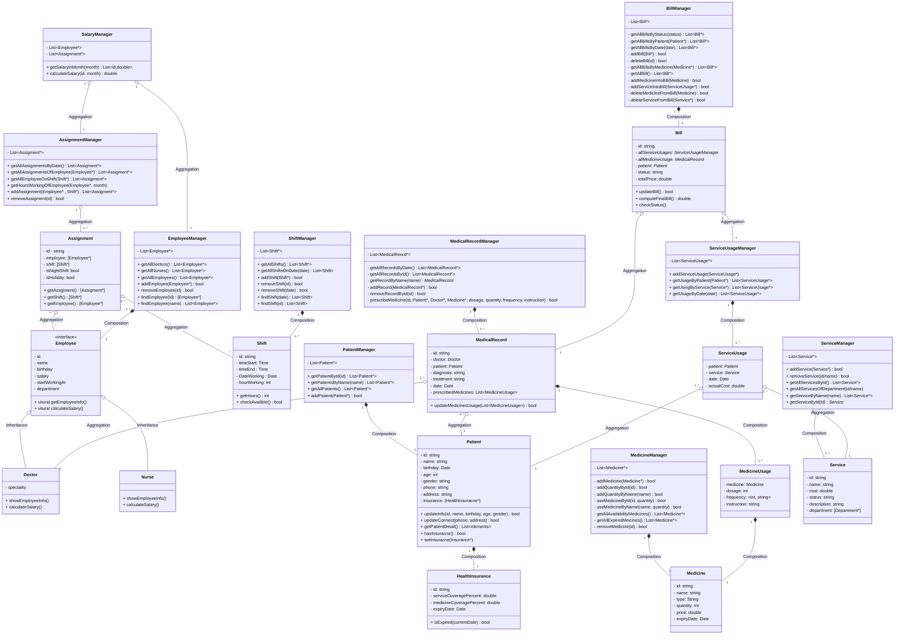

# Class Diagram (update 1-5)
## Class Diagram toàn bộ mô hình

```mermaid
classDiagram

Employee <|-- Doctor: Inheritance
Employee <|-- Nurse: Inheritance
Patient "1" *-- "1" HealthInsurance: Composition
Assignment "1..*" o-- "*" Shift: Aggregation
Assignment "1..*" o-- "*" Employee: Aggregation
AssignmentManager "1" o-- "1..*" Assignment: Aggregation
PatientManager "1" *-- "1..*" Patient: Composition
ShiftManager "1" *-- "1..*" Shift: Composition
EmployeeManager "1..*" *-- "1" Employee: Composition
SalaryManager "1" o-- "1" AssignmentManager: Aggregation
SalaryManager "1" o-- "1" EmployeeManager: Aggregation
MedicineManager "1" *-- "1..*" Medicine: Composition
MedicineUsage "1" *-- "1" Medicine: Composition
MedicalRecord "1" *-- "1..*" MedicineUsage: Composition
MedicalRecord "1..*" o-- "1" Doctor: Aggregation
MedicalRecord "1..*" o-- "1" Patient: Aggregation
MedicalRecordManager "1" *-- "1..*" MedicalRecord: Composition
ServiceManager "1" *-- "1..*" Service: Composition
ServiceUsage "1..*" o-- "1" Patient: Aggregation
ServiceUsage "1..*" o-- "1" Service: Aggregation
ServiceUsageManager "1" *-- "1..*" ServiceUsage :Composition
Bill "1" o-- "1" ServiceUsageManager : Aggergation
Bill "1" o-- "1" MedicalRecord: Aggergation
BillManager "1" *-- "1" Bill: Composition
class Patient{
- id: string
- name: string
- birthday: Date
- age: int
- gender: string
- phone: string
- address: string
- insurance: [HealthInsuracne*]
+ updateInfo(id, name, birthday, age, gender) bool
+ updateConnect(phone, address) bool
+ getPatientDetail()  List~elements~
+ hasInsuracne()  bool
+ setInsuracne(Insurance*)
}

class HealthInsurance{
- id: string
- serviceCoveragePercent: double
- medicineCoveragePercent: double
- expiryDate: Date
+ isExpired(currentDate) bool
}

class Employee{
<<interface>>
- id
- name
- birthday
- salary
- startWorkingAt
- department
+ vitural getEmployeeInfo()
+ vitural calculateSalary()
}

class Doctor{
- speciality
+ showEmployeeInfo()
+ calculateSalary()
}

class Nurse{
+ showEmployeeInfo()
+ calculateSalary()
}

class Shift{
- id: string
- timeStart: Time
- timeEnd : Time
- DateWorking : Date
- hourWorking: int
+ getHours() int
+ checkAvailible() bool
}

class ShiftManager{
- List~Shift*~
+ getAllShifts() List~Shift*~
+ getAllShiftsOnDate(date) List~Shift~
+ addShift(Shift* ) bool
+ removeShift(id) bool
+ removeShift(date) bool
+ findShift(date) List~Shift~
+ findShift(id) List~Shift~
}

class Assignment{
- id - string
- employee: [Employee*]
- shift: [Shift*]
- isNightShift: bool
- isHoliday: bool
+ getAssgiment() [Assigment*]
+ getShift() [Shift*]
+ getEmployee() [Employee*]
}

class AssignmentManager{
- List~Assigment*~
+ getAllAssignmentsByDate() List~Assigment*~
+ getAllAssignmentsOfEmployee(Employee*) List~Assigment*~
+ getAllEmployeeOnShift(Shift*) List~Assigment*~
+ getHoursWorkingOfEmployee(Employee*, month)
+ addAssignment(Employee* , Shift*) List~Assigment*~
+ removeAssigment(id) bool
}

class PatientManager{
- List~Patient*~
+ getPatientById(id) List~Patient*~
+ getPatientsByName(name) List~Patient*~
+ getAllPatients() List~Patient*~
+ addPatient(Patient*) bool
}

class EmployeeManager{
- List~Employee*~
+ getAllDoctors() List~Employee*~
+ getAllNurses() List~Employee*~
+ getAllEmployees() List~Employee*~
+ addEmployee(Employee*) bool
+ removeEmployee(id) bool
+ findEmployee(id) [Employee*]
+ findEmployee(name) List~Employee*~
}

class SalaryManager{
- List~Employee*~
- List~Assignment*~
+ getSalaryInMonth(month) List~id,double~
+ calculateSalary(id, month) double
}

class Medicine{
- id: string 
- name: string
- type: String 
- quantity: int
- price: double
- expiryDate: Date
}

class MedicineManager{
- List~Medicine*~
- addMedicine(Medicine*) bool
- addQuantityById(id) bool
- addQuantityByName(name) bool
- useMedicineById(id, quantity) bool
- useMedicineByName(name, quantity) bool
- getAllAvailabilityMedicines() List~Medicine*~
- getAllExpiredMeicines() List~Medicine*~
- removeMedicine(id) bool
}

class MedicineUsage{
- medicine: Medicine
- dosage: int
- frequency: ~int, string~
- instruction: string
}

class MedicalRecord{
- id: string
- doctor: Doctor*
- patient: Patient*
- diagnosis: string
- treatment: string
- date: Date
- prescribedMedicines: List~MedicineUsage~
+ updateMedicinesUsage(List~MedicineUsage~) bool
}

class MedicalRecordManager{
- List~MedicalReord*~
- getAllRecordsByDate() List~MedicalRecord*~
- getAllRecordsById() List~MedicalRecord*~
- getRecordByName(name) MedicalRecord*
- addRecord(MedicalRecord*) bool
- removeRecordByid(id) bool
- prescribeMedicine(id, Patient*, Doctor*, Medicine*, dosage, quantity, frequency, instruction) bool
}

class Service{
- id: string
- name: string
- cost: double
- status: string
- description: string
- department: [Department*]
}

class ServiceManager{
- List~Service*~
+ addService(Service*) bool
+ removeService(id/name) bool
+ getAllServicesById() List~Service*~
+ getAllServicesOfDepartment(id/name)
+ getServiceByName(name) List~Service*~
+ getServiceById(id) Service*
}

class ServiceUsage{
- patient: Patient*
- service: Service*
- date: Date
- actualCost: double
}

class ServiceUsageManager{
- List~ServiceUsage*~
+ addServiceUsage(ServiceUsage*)
+ getUsageByPatient(Patient*) List~ServiceUsage*~
+ getUsingByService(Service*) List~ServiceUsage*~
+ getUsageByDate(date) List~ServiceUsage*~
}

class Bill{
- id: string
- allServiceUsages: ServiceUsageManager*
- allMedicineUsage: MedicalRecord*
- patient: Patient*
- status: string
- totalPrice: double
+ updateBill() bool
+ computeFinalBill() double
+ checkStatus()
}

class BillManager{
- List~Bill*~
- getAllBillsByStatus(status) List~Bill*~
- getAllBillsByPaitent(Patient*) List~Bill*~
- getAllBillsByDate(date) List~Bill*~
- addBill(Bill*) bool 
- deleteBill(id) bool
- getAllBillsByMedicine(Medicine*) List~Bill*~
- getAllBill() List~Bill*~
- addMedicineIntoBill(Medicine) bool 
- addServiceIntoBill(ServiceUsage*) bool
- deleteMedicineFromBill(Medicine) bool
- deleteServiceFromBill(Serivice*) bool
}

```