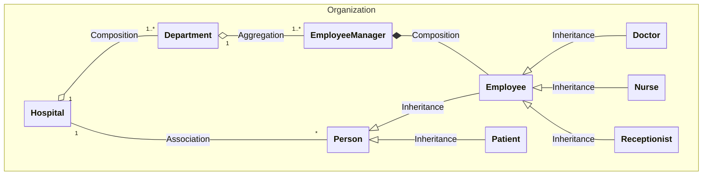
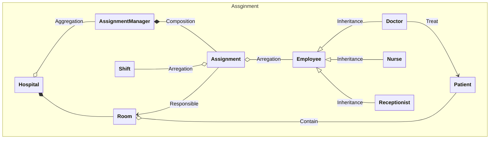
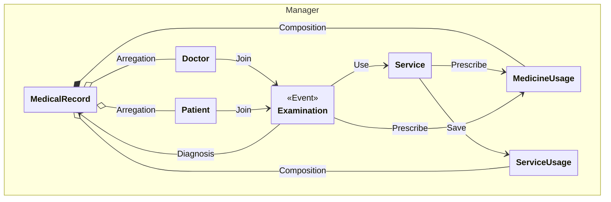
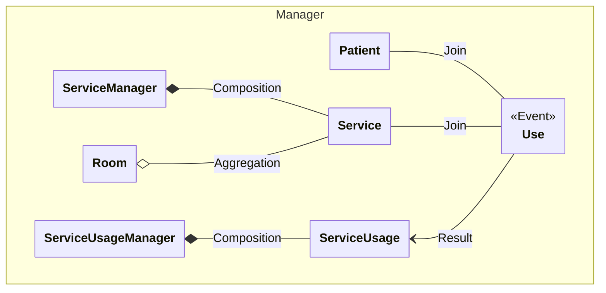
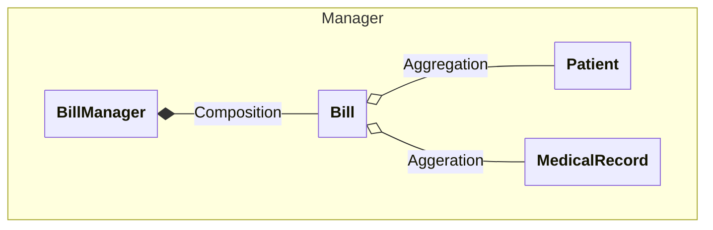
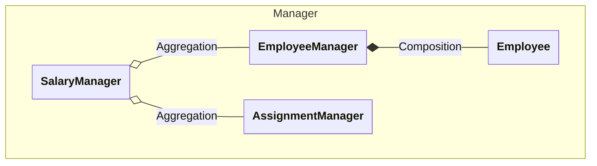
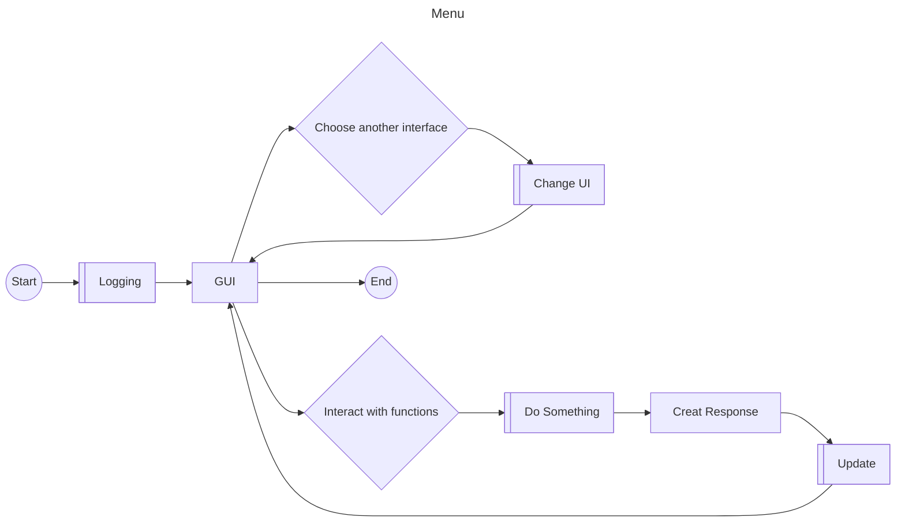
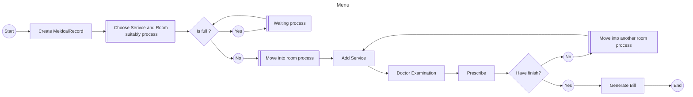

# A. Class Diagram

## 1. Clas Diagram cho chức năng quản lí nhân viên, bệnh nhân.

## 2. Class Diagram cho chức năng phân chia ca trực.

## 3. Class Diagram cho chức năng chuẩn đoán và kê thuốc cho bệnh nhân.

## 4. Class Diagram cho chức năng quản lí dịch vụ 

## 5. Class Diagram chức năng thanh toán những thuốc và dịch vụ sử dụng.

## 6. Class Diagram cho chức năng thống kê lương, tính lương

# B. Mô tả các bước chương trình hoạt động

## 1. Mô tả quá trình quản lí cơ sở dữ liệu (Nhân viên, khoa, ca trực,...)
- Bước 1: Khi chương trình khởi động, khởi tạo cơ sở dữ liệu (Đọc file/Sử dụng Hệ quản trị).
- Bước 2: Thực hiện các chức năng tương tác với Model (Thêm/Xoá/Sửa) trên chương trình.
- Bước 3: Lưu vào cơ sở dữ liệu (Hệ quản trị/ file).

## 2. Mô tả quá trình khám chữa bệnh.
- Bước 1: Bệnh nhân sẽ tạo sổ khám bệnh (`MedicalRecord`) và chờ được điều vào phòng cần thiết. Hồ sơ bao gồm thông tin cá nhân của bệnh nhân, triệu chứng, ngày đi khám,...
- Bước 2: Dựa vào triệu chứng, ta sẽ phân luồng vào phòng khám của khoa chuyên điều trị loại bệnh đó, nếu rõ triệu chứng hoặc chung chung thì mặc định vô phòng thuộc khoa "Noi Tong Quat".
- Bước 3: Kiểm tra phòng khám còn chỗ không. Nếu trống thì chuyển hồ sơ vào đó và bắt đầu khám. Nếu phòng quá tải thì phải đưa vào khu chờ đợi đến lượt.
- Bước 4: Khi được khám, gán bác đã khám cho bệnh nhân đó vào sổ khám. Sau đó bác sĩ sẽ thực hiện chuẩn đoán. Sau khi chuẩn đoán xong thì, bác sĩ sẽ cho thuốc. Nếu cảm thấy nghi ngờ, bác sĩ có thể chuyển qua sử dụng dịch vụ khác (Xét nghiệm máu, xét nghiệm nước tiểu,...) của phòng khác, quay lại bước 3. Các phòng đều thực hiện dịch vụ cũng như kê thuốc. Nếu như cảm thấy ổn, không cần chuyển nữa thì hoàn tất khám, bắt đầu xuất hoá đơn. Tất cả dịch vụ và thuốc được kê đều được tổng hợp vào hồ sơ. 
- Bước 5: Thanh toán hoá đơn qua hồ sơ, mỗi hoá đơn thanh toán cho một hồ sơ một lúc. Hoá đơn tính giá tiền từ thuốc và dịch vụ mà bệnh nhân đã sử dụng kết hợp bảo hiểm y tế.

## C. Luồng chương trình bằng hình vẽ.

## 1. Luồng hệ thống tổng quát

2. Luồng chức năng khám chữa bệnh
