# 1. Class Diagram chi tiết cho chức năng quản lí nhân sự, bệnh nhân.

```mermaid
classDiagram
class Hospital{
- _name: string
- _address: Address
- _phone: Phone 
- List~Department*~
}

class DepartmentInfo{
- _id: string
- _name: string
- _location: string
- _requiredSpecialty: string
- _maxStaff: int
+ getter()
+ construct()
}

class DepartmentStaffManager{
+ addEmployee(List~Employee*~ , Employee*) bool
+ removeEmployee(List~Employee~, id) bool
+ getAllEmployees() List~Employee*~ 
}

class DepartmentHeadManager{
- _head: Doctor*
- _requiredSpecialty: string
+ constructor()
+ destructor()
+ getter()
+ setter()
}

class Department{
- _info: class DepartmentInfo
- _staffs: List~Employee*~
- _staffManager: class DepartmentStaffManager
- _headDoctor: class DepartmentHeadManager 
+ getter() 
+ setter()
+ headDoctor(): Employee*
+ assignHead(Doctor*): bool
+ addEmployee(Employee*): bool
+ getAllEmployees() List~Employee*~ 
}

class IDepartmentRepository{
+ ~IDepartmentRepository() virtual (Default)
+ save(Department*):  bool - virtual (Default)
+ loadAll(): List~Department*~- virtual
}

class TxtDepartmentRepository{
- _path: string 
+ constructor()
+ save(Department*): override
+ loadAll(): override
}

class DepartmentService{
- _repo: class IDepartmentRepository
+ constructor()
+ createAndSave(id, name, maxstaff = 100, reqSpec = "Noi Tong Quat"): bool
+ loadDepartments(): List~Department*~ 
+ removeAndSave(id): bool
}

class IPerson{
<<Interface>>
+ name() 
+ address() 
+ id() 
+ birthDate() 
+ age() 
+ phone() 
}

class Person{
- _id: string
- _fullname: string
- _homeAdress: Address
- _birthDate: Date
- _phone: Phone
}

class Patient{
- _allergies: List~String~
- _medicineUsages: List~MedicineUsages~
}

class Employee{
- _startWorkingAt: Date
- _education: string
- _baseSalary: double
}

class Doctor{
- _specialty: List~string~
}

class Nurse{
}

class Receptionist{
}
```

# 2. Mô tả chức năng quản lí nhân viên, khoa
- Class `Hospital` có nhiệm vụ chính chứa thông tin của bệnh viện và thông tin của các khoa, đồng thừa cung cấp dữ liệu cho các hàm CRUD mà `DepartmentService` cung cấp.
- Class `DeparmentService` có chức năng cung cấp các phương thức CRUD cơ bản và tương tác trên interface `IDepartmentRepository`. Mục đích của `DepartmentService` là để điều phối cho việc thao tác database qua interface và giảm trách nhiệm của `Hospital`.
- Interface `IDepartmentRepository` bắt buộc triển khai 2 phương thức chính là `reload()` và `save()` nhằm mục đích đồng bộ hoá với dữ liệu trên database.
- class `TxtDepartmentRepository` triển khai interface nhằm lưu file dưới dạng .txt.
- Các lớp còn lại như `DeparmentInfo`, `DepartmentHeadManager` và `DepartmentStaffManager` nhằm để quản lí các nhân viên trong cùng một khoa.

# 3. Yêu cầu của chức năng.
- `Patient` và `Employee` kế thừa Person, `Doctor`, `Receptionist` và `Nurse` kế thừa `Employee`.
- Ghi đủ setter, getter.
- Phải xài con trỏ thông minh, xài dạng shared pointer.
- Cấu trúc lưu file .txt có dạng
VD: DEPT|idKhoa|tenKhoa|location|chuyenMon|SoNVToiDa
    HEAD|idTRuongKhoa|TenTK|DiaChi|NgaySinh|STD|ChuyenMon|BangCap
    EMP|idNV|tenNV|DiaChi|NgaySinh|SDT|STD|ChuyenMon|BangCap
    .......
- Trưởng khoa có thể có hoặc không, trưởng khoa phải là bác sĩ phải thoả có chuyên môn phù hợp với yêu cầu của khoa và có bằng "Tien Si".
- Khi thêm một nhân viên vào khoa, phải kiểm tra sức chứa của khoa.
- Có thể xài template nếu được.
- Phải triển khai đầy đủ các phương thức của interface.
- Tuân thủ code convention.